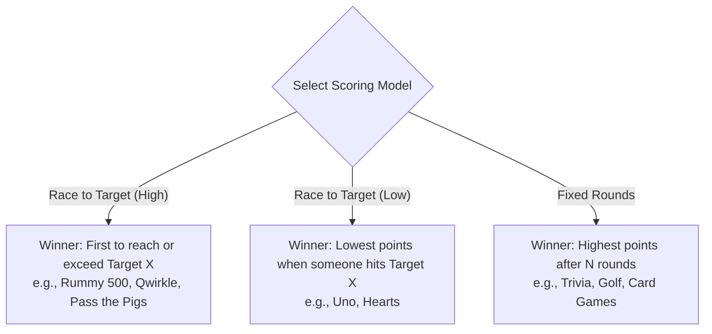

# Explanation: Product Architecture & Scoring Mechanics

This document explains the design philosophy, aesthetic choices, and game-theoretic scoring models underlying **TallyHo**.

---

## 1. Design Philosophy: The Digital Score Pad

Scorekeeping apps often fail because they try to be games themselves, with overly flashy animations, dark futuristic gradients, or intrusive banners that distract from the physical table.

**TallyHo's Philosophy**:

1. **Utility First**: Acts as an unobtrusive table utility—digital pencil and paper that feels natural next to physical cards and boards.
2. **Paper-and-Ink Aesthetic**:
   - Canvas: Warm tactile cream (`#FDFBF7`) evoking fresh score card paper.
   - Ink: Crisp charcoal slate (`#2C302E`) for maximum contrast and legibility.
   - Accents: Subtle vintage tones (terracotta, forest green, warm amber) for player avatars.
3. **Tactile Delight**: Crisp mechanical haptic impulses upon keypad button presses and subtle confetti upon match victory.

---

## 2. Universal Scoring Mechanics

TallyHo abstracts diverse board, card, and dice games into three foundational scoring models:

### Model 1: Race to Target (High Score)

- **Target Condition**: First player whose total score reaches or exceeds $X$ points.
- **Victory Rule**: Highest cumulative score at the end of the decisive round wins.
- **Classic Examples**: _Rummy (500)_, _Qwirkle (100)_, _Pass the Pigs (100)_, _Munchkin (10)_.

### Model 2: Race to Target (Low Score)

- **Target Condition**: Game ends when any player hits or exceeds $X$ points (penalty threshold).
- **Victory Rule**: Player with the lowest total score wins.
- **Classic Examples**: _Uno (500 penalty)_, _Hearts (100 penalty)_.

### Model 3: Fixed Rounds

- **Target Condition**: Game plays for exactly $N$ predetermined rounds.
- **Victory Rule**: Highest cumulative score at round $N$ wins.
- **Classic Examples**: _Trivia_, _Custom Board Game Rounds_, _Golf_.

---

## 3. Real-Time Margin & Lead Calculations

To heighten game-night engagement, TallyHo computes dynamic margins after each turn:

- **Leader Indicator**: Instantly marks the active front-runner.
- **Point Margins**: Calculates how many points each opponent is trailing by (e.g. `"-14 pts"`).
- **Comeback Highlights**: End-of-match analytics calculate the largest single-round point surge ("Biggest Comeback").
