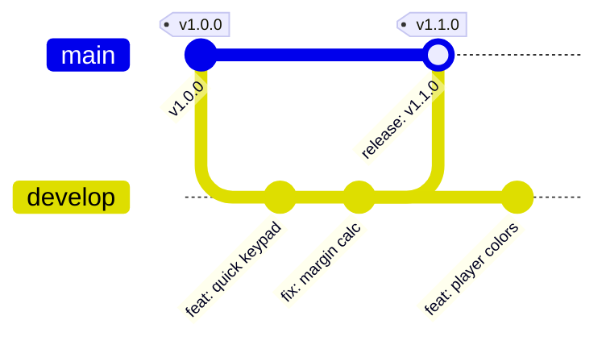

# Explanation: Branching Strategy & Versioning Architecture

This document explains why and how **TallyHo** uses a streamlined two-branch Git strategy paired with strict Semantic Versioning.

---

## 1. Two-Branch Git Flow

Rather than using complex multi-branch models with long-lived staging branches, TallyHo employs a predictable two-branch Git structure:

### Branch Roles

- **`main`**: Production branch. Every commit on `main` represents a released or release-candidate state. Production releases are triggered via annotated Git tags (`v*.*.*`).
- **`develop`**: Integration and active staging branch. All feature branches (`feat/*`), bug fixes (`fix/*`), and chore branches target `develop`.

---

## 2. Release & Versioning Philosophy

TallyHo adheres to **Semantic Versioning 2.0.0** (`MAJOR.MINOR.PATCH`):

1. **MAJOR (`X.0.0`)**: Breaking architectural changes or complete game engine overhauls.
2. **MINOR (`1.X.0`)**: New scoring models, major feature additions, or UI redesigns.
3. **PATCH (`1.0.X`)**: Bug fixes, scoring edge-case adjustments, and performance optimizations.

### Why Remote Version Code Management?

In EAS Build, `eas.json` is configured with `appVersionSource: "remote"`. This allows EAS to automatically manage and increment Android `versionCode` and iOS `buildNumber` in cloud storage, preventing build number collision across parallel developer machines.
