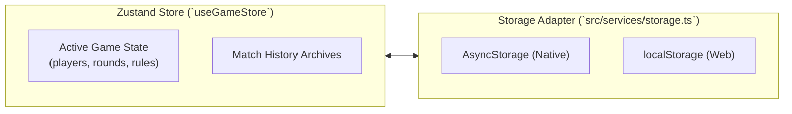

# Explanation: Persistence, State Stores & Schema Migrations

This document explains state persistence, Zustand hydration, and schema migration strategies in **TallyHo**.

---

## 1. Offline-First State Architecture

Table games frequently take place in basements, parks, or areas with spotty cellular connection. TallyHo operates 100% offline-first.

### Store Structure

- **`useGameStore`**: Manages active match state, round logs, player tallies, and finished match archives.
- **`usePlayerLibraryStore`**: Maintains quick-select reusable player profiles (names, favorite colors, initials).
- **`useSettingsStore`**: Manages theme modes, audio toggles, haptic preferences, and Pro entitlement status.

---

## 2. Schema Evolution & Safe Migrations

As new game modes and features are added, local device state schemas evolve. TallyHo uses guarded versioned migrations:

1. **Schema Versioning**: Stored payloads include a `_schemaVersion: number` metadata field.
2. **Defensive Hydration**:
   - Initial state provides explicit fallbacks for missing fields in legacy records.
   - Corrupted or incompatible records trigger non-destructive schema upgrades rather than crashing the interface.
3. **User-Controlled Reset**:
   - Users can safely purge or export corrupted state via **Settings > Reset Local Storage**.
